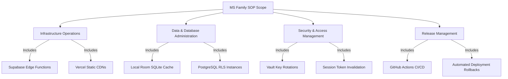

    
Chapter 04

    <h1>Purpose, Scope &amp; Governance</h1>
    
Operational Bounds, Compliance, and Business Governance Standards

## 1. Objectives of the Manual
This Standard Operating Procedures (SOP) Manual defines the procedures for running, monitoring, maintaining, and recovering the **MS Family** platform. It ensures operational consistency and reduces service interruptions.

## 2. Operational Scope
This document covers the following environments:

    
<svg fill="none" viewBox="0 0 24 24" stroke="currentColor"><path stroke-linecap="round" stroke-linejoin="round" stroke-width="2" d="M13 16h-1v-4h-1m1-4h.01M21 12a9 9 0 11-18 0 9 9 0 0118 0z"/></svg>

    

        
Excluded Scope Items

        
Hardware failures at Google Cloud (Gemini) or Supabase (PostgreSQL hosting) are managed under their respective SLAs and are excluded from this manual.

    

