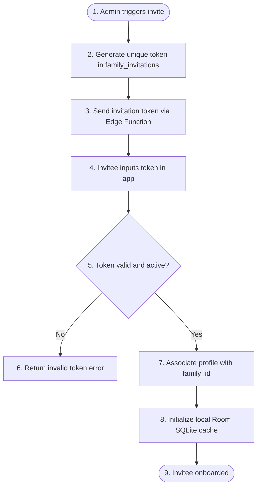

    
Chapter 07

    <h1>User Provisioning SOP</h1>
    
Account Lifecycles, Onboarding, and Security Provisioning Procedures

## SOP-USR-01: Member Invitation & Onboarding

### 1. Purpose
Defines the workflow for onboarding new family members.

### 2. Prerequisites
1. Requester must hold `role = 'admin'` for the target `family_groups` container.
2. Invitee must have a registered email address.

### 3. Step-by-Step Procedure

### 4. Exception Handling
* **Expired Token:** If the token has expired, the administrator must regenerate the invite, which invalidates the old record.
