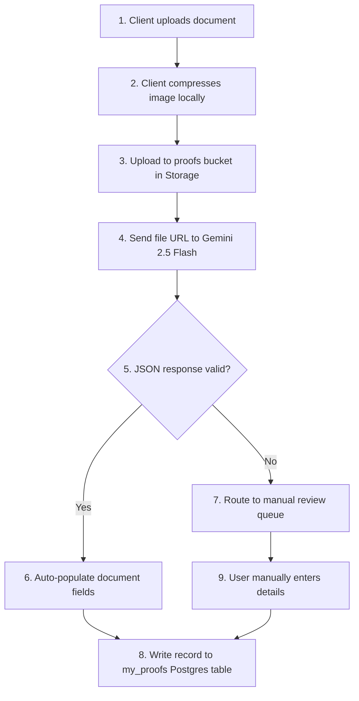

    
Chapter 10

    <h1>Secure Document Vault SOP</h1>
    
Ingestion Rules, Storage Policies, and OCR Validations

## SOP-DOC-01: Ingestion &amp; Gemini OCR Processing

### 1. Purpose
SOP for uploading documents to the vault, verifying Gemini OCR extractions, and archiving files.

### 2. Step-by-Step Ingestion Pipeline

### 3. Recovery Steps: Storage Allocation Failures
If storage uploads fail due to folder allocation limits:
1. Verify user's group tier is within resource boundaries.
2. Run storage cleanup sweeps to archive historical proofs older than 24 months.
