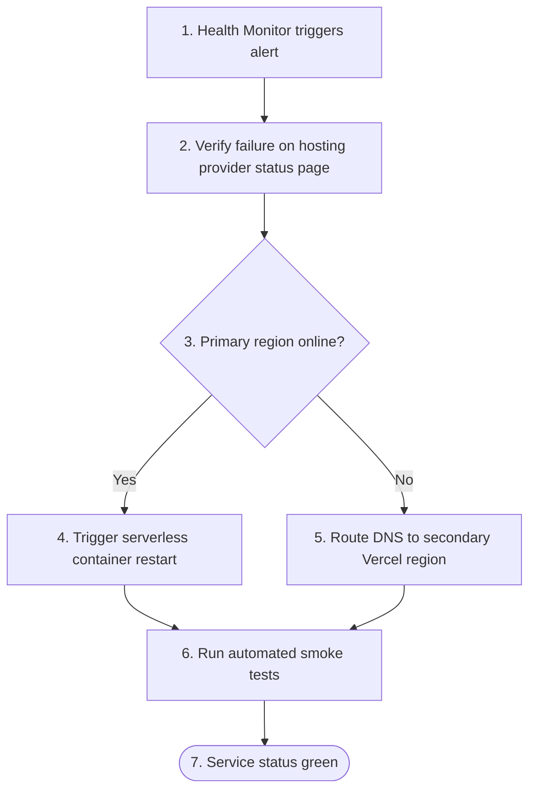

    
Chapter 14

    <h1>Disaster Recovery Playbook</h1>
    
Service Recovery Runbooks, Failures, and RTO/RPO Metrics

## 1. Operational RTO &amp; RPO Targets

* **Recovery Time Objective (RTO):** $< 4$ Hours (Maximum allowable downtime).
* **Recovery Point Objective (RPO):** $< 24$ Hours (Maximum allowable data loss window).

## 2. Server Failure Recovery Procedure
In the event of a total Vercel edge CDN or static assets server failure:

    
<svg fill="none" viewBox="0 0 24 24" stroke="currentColor"><path stroke-linecap="round" stroke-linejoin="round" stroke-width="2" d="M9 12l2 2 4-4m5.618-4.016A11.955 11.955 0 0112 2.944a11.955 11.955 0 01-8.618 3.04A12.02 12.02 0 003 9c0 5.591 3.824 10.29 9 11.622 5.176-1.332 9-6.03 9-11.622 0-1.042-.133-2.052-.382-3.016z"/></svg>

    

        
DR Action Security Authorization

        
DNS failover modifications require two-factor authorization approval from the CSO or designated Operations Lead.

    

