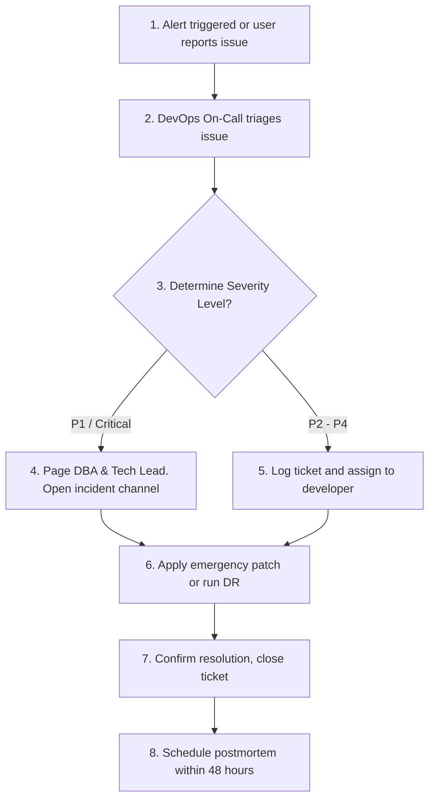

    
Chapter 18

    <h1>Incident Severity SOP</h1>
    
Severity Classification levels, Timelines, and Postmortems

## SOP-INC-01: Incident Severity Matrix

### 1. Purpose
Defines response times and triage priorities during system incidents.

### 2. Severity Classification Matrix

<!-- table: Incident Severity Levels -->
| Severity | Description | Initial Response | Resolution SLA |
| :--- | :--- | :--- | :--- |
| **P1 - Critical** | Core platform down (login fails, database unreachable). | $< 15$ Minutes | $< 2$ Hours |
| **P2 - Major** | Single module degraded (OCR failing, WebRTC voice cuts). | $< 30$ Minutes | $< 8$ Hours |
| **P3 - Minor** | Minor functionality issue (dashboard graph rendering lag). | $< 2$ Hours | $< 24$ Hours |
| **P4 - Low** | Cosmetical issue or UI styling bugs. | $< 24$ Hours | Next Sprint |

### 3. Step-by-Step Incident Triage

