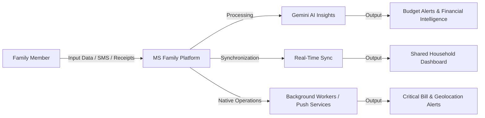

    
Chapter 03

    <h1>Executive Summary</h1>
    
Vision, Mission, and Platform Value Proposition

    

        <strong>Summary:</strong> This chapter outlines the strategic objectives, problem space, and the business case for the MS Family platform.
    

## Project Identity
* **System Title:** MS Family Home &amp; Family Management Platform
* **Document Version:** v1.0.0-Enterprise
* **Authoring Body:** Core Software Engineering &amp; Architecture Group

## 1. System Vision
The MS Family platform addresses the fragmentation of household logistics and family financial operations. By combining modern web architectures, native mobile integrations, and generative AI interfaces, the platform provides a unified workspace for managing shared household resources.

## 2. Mission
The platform coordinates household management by:
1. Fusing shared ledgers with automatic native SMS background receipt detection.
2. Indexing documents in a secure vault with Gemini-based metadata extraction.
3. Automating medication and loan EMI reminders via background scheduling services.
4. Providing real-time family location tracking and peer-to-peer WebRTC calls.

    
<svg fill="none" viewBox="0 0 24 24" stroke="currentColor"><path stroke-linecap="round" stroke-linejoin="round" stroke-width="2" d="M13 16h-1v-4h-1m1-4h.01M21 12a9 9 0 11-18 0 9 9 0 0118 0z"/></svg>

    

        
Strategic Alignment

        
MS Family consolidates multiple household tools (finance ledgers, document storage, calendars, and location sharing) into a single, secure application.

    

