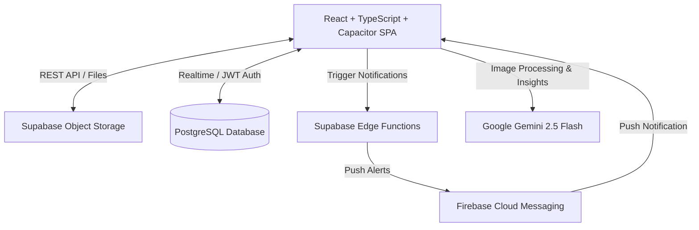

    
Chapter 04

    <h1>Project Overview</h1>
    
Context, Ecosystem Structure, and Module Definitions

    

        <strong>Summary:</strong> An introduction to the software modules, dependencies, and deployment structure of the MS Family system.
    

## 1. System Context
The MS Family platform is built as a responsive Single-Page Application (SPA) using React, Vite, TypeScript, and Tailwind CSS. It is wrapped as a native hybrid app via Capacitor, allowing access to native Android APIs.

## 2. Module Specifications

### Financial Ledger & Analytics
Tracks income, expenses, and savings goals linked to user profiles. Features Recharts-based visual graphs and monthly resets.

### Smart SMS Ingestion
Native Android receivers (`SmsBackgroundReceiver`) capture banking transaction SMS alerts, parse details locally, and upsert records to Supabase.

### Secure Document Vault (MyProofs)
Uploads receipt and prescription files to Supabase Storage, using the Gemini API to run OCR and extract metadata (merchant, total, and document summary).

### Location Tracking & Geolocation
Tracks family member locations in real-time, displaying them on a shared Leaflet map with battery status reports.

### WebRTC VoIP calling
Provides direct peer-to-peer voice calls using Supabase Realtime channels for signaling.

    
<svg fill="none" viewBox="0 0 24 24" stroke="currentColor"><path stroke-linecap="round" stroke-linejoin="round" stroke-width="2" d="M9 12l2 2 4-4M7.835 4.697a3.42 3.42 0 001.946-.806 3.42 3.42 0 014.438 0 3.42 3.42 0 001.946.806 3.42 3.42 0 013.138 3.138 3.42 3.42 0 00.806 1.946 3.42 3.42 0 010 4.438 3.42 3.42 0 00-.806 1.946 3.42 3.42 0 01-3.138 3.138 3.42 3.42 0 00-1.946.806 3.42 3.42 0 01-4.438 0 3.42 3.42 0 00-1.946-.806 3.42 3.42 0 01-3.138-3.138 3.42 3.42 0 00-.806-1.946 3.42 3.42 0 010-4.438 3.42 3.42 0 00.806-1.946 3.42 3.42 0 013.138-3.138z"/></svg>

    

        
Architecture Target

        
Offline availability is supported by caching data in a local Room SQLite database before syncing changes with Supabase.

    

