    
Chapter 06

    <h1>Non-Functional Requirements</h1>
    
Performance Targets, Reliability, Security, and Compliance

    

        <strong>Summary:</strong> Outlines the non-functional requirements, latency thresholds, security standards, and device support targets.
    

## 1. Performance & Latency Targets
* **Initial Page Load:** The app loader must resolve in $< 1.5$ seconds on 3G networks.
* **Cached Database Queries:** Local Room SQLite queries must display data within $300	ext{ ms}$.
* **API Response Time:** Supabase queries and Edge Functions must respond within $250	ext{ ms}$.
* **Gemini OCR Processing:** Image uploads and OCR analysis must complete within $5.0$ seconds.

```mermaid
%% id: diag-performance
%% caption: System Latency Target Budgets
gantt
    title Latency Targets by System Operation
    dateFormat  X
    axisFormat %s
    section Core Operations
    Offline Room DB Load (300ms)    :active, 0, 300
    Supabase API Queries (250ms)     :active, 0, 250
    UI Page Transition (150ms)       :active, 0, 150
    section Heavy Processing
    Gemini OCR Parsing (5.0s)       :active, 0, 5000
    WebRTC Call Signaling (1.2s)     :active, 0, 1200
```

## 2. Availability & Reliability
* **System Uptime:** Hosted services must maintain $\ge 99.9\%$ availability.
* **Offline Fallback:** When offline, the app must route write operations to the local cache (`TransactionCachePlugin`) and sync them once the connection is restored.
* **Network Monitoring:** Active network state is tracked via `@capacitor/network` to handle offline-to-online transitions.

    
<svg fill="none" viewBox="0 0 24 24" stroke="currentColor"><path stroke-linecap="round" stroke-linejoin="round" stroke-width="2" d="M12 9v2m0 4h.01m-6.938 4h13.856c1.54 0 2.502-1.667 1.732-3L13.732 4c-.77-1.333-2.694-1.333-3.464 0L3.34 16c-.77 1.333.192 3 1.732 3z"/></svg>

    

        
Sync Retries

        
The sync worker uses an exponential backoff strategy for failed sync operations to prevent overloading the database.

    

