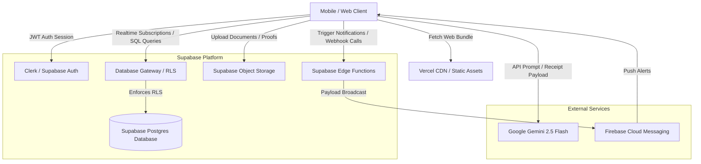

    
Chapter 07

    <h1>System Architecture</h1>
    
Cloud Topology, Client-Server Paths, and Processing Nodes

    

        <strong>Summary:</strong> Outlines the cloud architecture, API gateways, security policies, and integrations of the MS Family system.
    

## 1. Cloud Architecture Blueprint
The platform uses a decoupled serverless architecture, separating database operations, background tasks, and AI integrations.

## 2. Core Processing Nodes

### Client Edge Layer
Vite bundles assets for web and mobile. On Android, Capacitor bridges JavaScript requests to Kotlin workers (such as GPS tracking, Biometrics, and SMS receivers).

### API & Security Gateway (Supabase)
Intercepts client requests, validates JWT tokens, and evaluates Row-Level Security (RLS) policies against the target rows before executing database queries.

### Serverless Layer
Deno Edge Functions handle background notifications via FCM and fetch external currency/gold rates.

    
<svg fill="none" viewBox="0 0 24 24" stroke="currentColor"><path stroke-linecap="round" stroke-linejoin="round" stroke-width="2" d="M9 12h6m-6 4h6m2 5H7a2 2 0 01-2-2V5a2 2 0 012-2h5.586a1 1 0 01.707.293l5.414 5.414a1 1 0 01.293.707V19a2 2 0 01-2 2z"/></svg>

    

        
ADR Reference: Decoupled Gateways

        
Using Supabase's direct PostgREST API reduces network hops, routing read/write actions directly to PostgreSQL through RLS policies. Detailed decisions are documented in <a href="#37_adr">ADR-002</a>.

    

