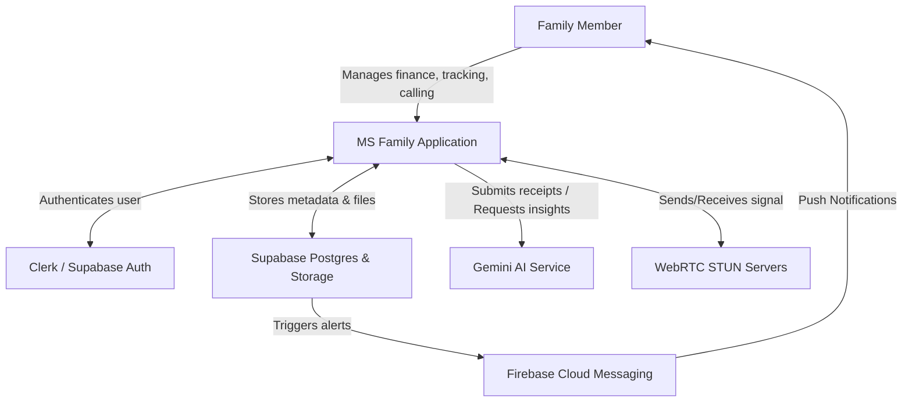
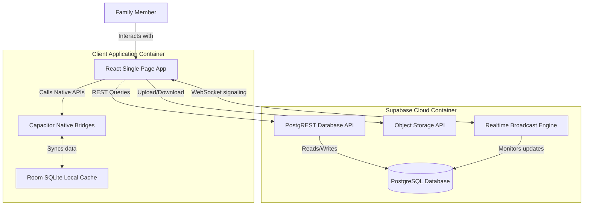
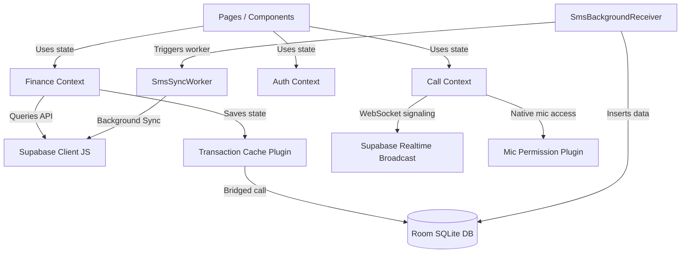

    
Chapter 08

    <h1>C4 Model Blueprint</h1>
    
C4 Context, Containers, Components, and Code Views

    

        <strong>Summary:</strong> Displays C4 blueprints illustrating system contexts, containers, components, and code interfaces.
    

## 1. Level 1: System Context Diagram
Shows how the system interacts with users and external services.

---

## 2. Level 2: Container Diagram
Explains the logical containers that compose the MS Family system.

---

## 3. Level 3: Component Diagram (Frontend & Client)
Illustrates component relationships inside the client application wrapper.

