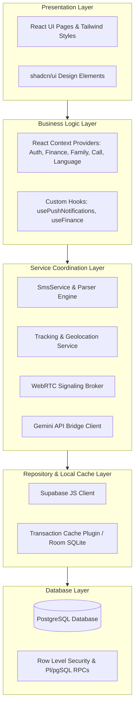

    
Chapter 09

    <h1>High-Level Layered Architecture</h1>
    
Presentation, Business, Service, Cache, and Database Layering Patterns

    

        <strong>Summary:</strong> Outlines the n-tier architecture pattern of the MS Family system, showing the boundary responsibilities for each layer.
    

## 1. N-Tier Layering Model
The platform separates UI components from core business logic, background workers, and database operations.

## 2. Layer Definitions

### Presentation Layer
Builds the UI using React, Tailwind CSS, and shadcn/ui. Handles user input, state visualization, page routing, and charts.

### Business Logic Layer
Encapsulates transaction business rules, balance calculations, WebRTC signaling state transitions, and user session context.

### Service Coordination Layer
Bridges JavaScript frameworks with native phone APIs (such as geolocation background services and SMS interceptors).

### Repository & Cache Layer
Coordinates data reads and writes, routing queries to local Room databases when offline.
