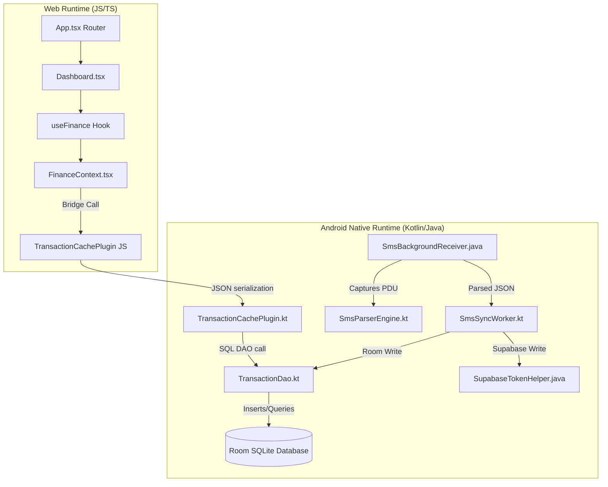

<div class="chapter-header">
    <div class="chapter-number-badge">Chapter 10</div>
    <h1>Low-Level Component Design</h1>
    <div class="chapter-subtitle">Bridge interfaces, Room structures, and background Kotlin workers</div>
    <div class="chapter-summary-box">
        <strong>Summary:</strong> Details the native plugins, Room database interfaces, and background Kotlin/Java worker scripts.
    </div>
</div>

## 1. Code Execution Map
Illustrates the interaction between JavaScript contexts and native Kotlin engines.



## 2. Native Component Specifications

### SmsParserEngine.kt
Runs regular expression parser trees to extract transaction types, amounts, and merchant details from SMS messages.

<div class="code-container">
    <div class="code-header">
        <span>android/app/.../SmsParserEngine.kt</span>
        <span class="code-lang-badge">kotlin</span>
    </div>
```kotlin
// Pre-compiled regex models for standard banking alert patterns
val amountRegex = Regex("(?i)(?:rs\.?|inr|amt)\s*([\d,]+\.?\d*)")
val debitRegex = Regex("(?i)(?:debited|spent|paid|withdrawn|charged)")
val creditRegex = Regex("(?i)(?:credited|deposited|received|added)")
```
</div>

### TransactionCachePlugin.kt
Exposes SQLite methods to the React layer, translating JavaScript objects into database rows.
