    
Chapter 11

    <h1>Database Design &amp; ERD</h1>
    
Relational Structure, Keys, Constraints, and Indexing Strategies

    

        <strong>Summary:</strong> Outlines the relational schema database model, indexes, and normalization configurations.
    

## 1. Database Entity Relationship Diagram
Displays the schema tables, primary/foreign keys, and data relationships.

```mermaid
%% id: diag-erd
%% caption: Physical Database Entity Relationship Diagram (ERD)
erDiagram
    PROFILES ||--o| FAMILY_MEMBERS : "joined via user_id"
    FAMILY_GROUPS ||--o{ FAMILY_MEMBERS : "contains members"
    FAMILY_GROUPS ||--o{ FAMILY_REQUESTS : "receives join requests"
    PROFILES ||--o{ FAMILY_REQUESTS : "sends join requests"
    FAMILY_GROUPS ||--o{ FAMILY_INVITATIONS : "issues invitations"
    PROFILES ||--o{ FAMILY_INVITATIONS : "receives invitations"
    
    PROFILES ||--o{ TRANSACTIONS : "records"
    FAMILY_GROUPS ||--o{ TRANSACTIONS : "aggregates"
    
    PROFILES ||--o{ LOANS : "owes / lends"
    FAMILY_GROUPS ||--o{ LOANS : "tracks"
    
    PROFILES ||--o{ SAVINGS_ASSETS : "accumulates"
    FAMILY_GROUPS ||--o{ SAVINGS_ASSETS : "displays"

    PROFILES ||--o{ MY_PROOFS : "owns documents"
    
    PROFILES ||--o{ NOTIFICATIONS : "receives alerts"
    PROFILES ||--o{ FCM_TOKENS : "registers push tokens"
    PROFILES ||--o| USER_LOCATIONS : "shares location"
    PROFILES ||--o| USER_PREFERENCES : "customizes"
```

## 2. Integrity & Performance Design

### Normalization (3NF)
The schema uses 3NF to avoid data duplication. Junction tables (such as `family_members`) decouple user profiles from family structures.

### Performance Indexing
B-tree indexes are configured for columns that are queried frequently:
* `idx_transactions_member_id` on `transactions(member_id)`
* `idx_family_members_user_id` on `family_members(user_id)`
* `idx_my_proofs_user_id` on `my_proofs(user_id)`
