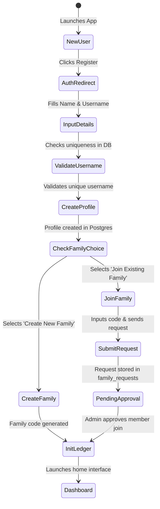
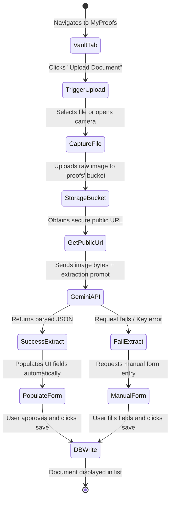

    
Chapter 13

    <h1>Core User Flows</h1>
    
Onboarding, Document OCR, and Location Sharing Flows

    

        <strong>Summary:</strong> Displays state transitions and process workflows for onboarding and document vault ingestion.
    

## 1. Onboarding &amp; Profile Creation Flow
Shows the steps required for a new user to register and join a family group.

---

## 2. Document OCR Ingestion Flow
Shows how a receipt or invoice is uploaded and processed using Gemini.

