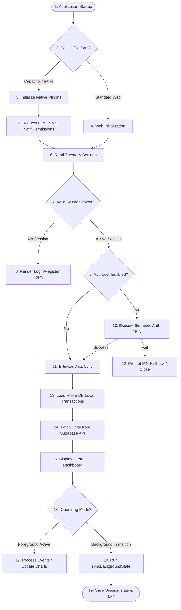

    
Chapter 14

    <h1>Application Lifecycle Flow</h1>
    
Application Lifecycle, State Transitions, and Background Execution

    

        <strong>Summary:</strong> Details the application lifecycle, from startup checks through to background execution.
    

## 1. Application Runtime States
Shows the initialization steps, biometric checks, and active synchronization processes.

    
<svg fill="none" viewBox="0 0 24 24" stroke="currentColor"><path stroke-linecap="round" stroke-linejoin="round" stroke-width="2" d="M13 16h-1v-4h-1m1-4h.01M21 12a9 9 0 11-18 0 9 9 0 0118 0z"/></svg>

    

        
Platform Lifecycle Event

        
In mobile applications, the `appStateChange` event triggers data synchronization automatically when the app is minimized.

    

