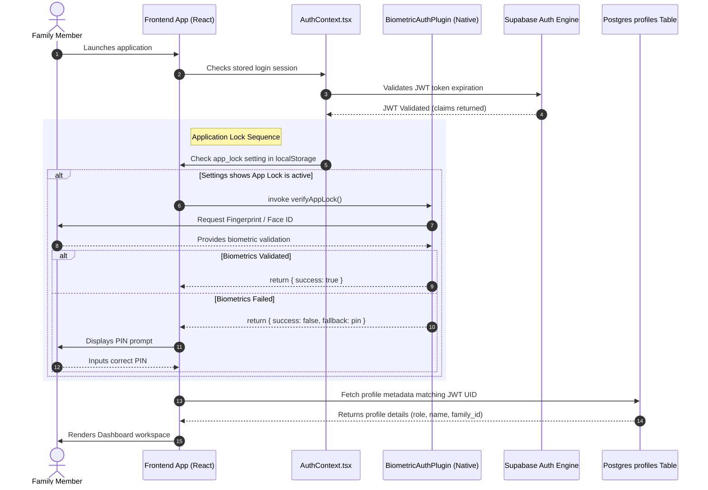

    
Chapter 15

    <h1>Authentication &amp; Lock Sequence</h1>
    
JWT Validations, Session Checks, and Biometric Lock Integrations

    

        <strong>Summary:</strong> UML sequence showing the steps for user authentication and biometric access validation.
    

## 1. Authentication Security Sequence
Describes how the client app interacts with native biometrics and remote databases.

