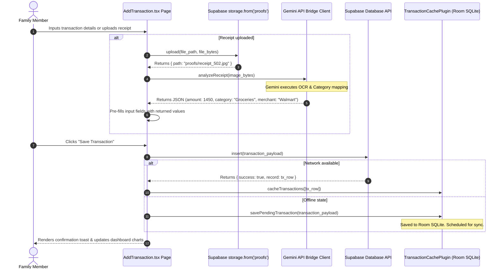

    
Chapter 16

    <h1>Expense &amp; OCR Ingestion Sequence</h1>
    
Manual entry, Storage uploads, Gemini parsing, and Local Caching

    

        <strong>Summary:</strong> Details the receipt processing pipeline, showing interactions between the client, Storage, and the Gemini API.
    

## 1. Ingestion Sequence
Steps for uploading and parsing receipt images.

