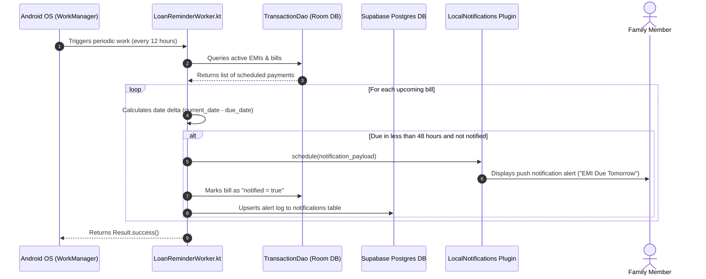

    
Chapter 17

    <h1>Bill Scheduler &amp; Alert Sequence</h1>
    
WorkManager triggers, Database checks, and Local Notification Dispatch

    

        <strong>Summary:</strong> Explains how the native scheduler triggers notifications for upcoming bills and EMIs.
    

## 1. Native Scheduling Sequence
Details the background execution steps that monitor payment schedules.

