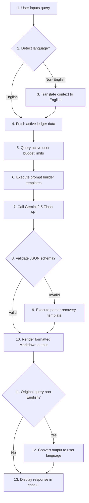

    
Chapter 18

    <h1>AI Assistant Reasoning Sequence</h1>
    
Language processing, Context builds, Gemini APIs, and Output translation

    

        <strong>Summary:</strong> Details the query parsing and context generation steps used by the AI assistant.
    

## 1. Inquiry Pipeline
Shows the processing steps for incoming user questions.

