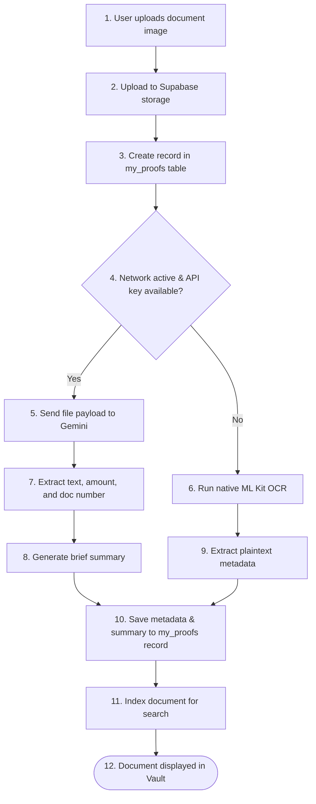

    
Chapter 19

    <h1>Secure Document Ingestion Sequence</h1>
    
File Compression, Supabase Storage, and Metadata Extraction

    

        <strong>Summary:</strong> Outlines the document ingestion process, detailing the storage path and search indexing.
    

## 1. Document Vault Flow
Shows the steps to upload and index document receipts.

