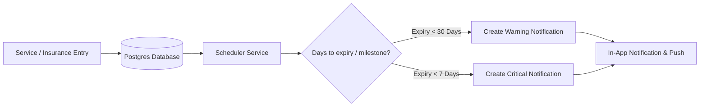

    
Chapter 20

    <h1>Vehicle Service &amp; Alert Sequence</h1>
    
Database columns, service schedules, and alert triggers

    

        <strong>Summary:</strong> Details the database design and notifications schedule used to track vehicle maintenance.
    

## 1. Service Alert Pipeline
Describes how service date thresholds trigger notifications.

---

## 2. Table: `vehicles`
Stores vehicle details.

<!-- table: Vehicles Database Schema -->
| Field | Type | Constraints | Description |
| :--- | :--- | :--- | :--- |
| `id` | `UUID` | `PRIMARY KEY` | Unique vehicle ID. |
| `name` | `TEXT` | - | Display name (e.g. Model Y). |
| `license_plate`| `TEXT` | `UNIQUE` | Registration number. |
| `purchase_date`| `DATE` | - | Purchase date. |
| `family_id` | `UUID` | `REFERENCES family_groups(id)` | Link to family container. |
