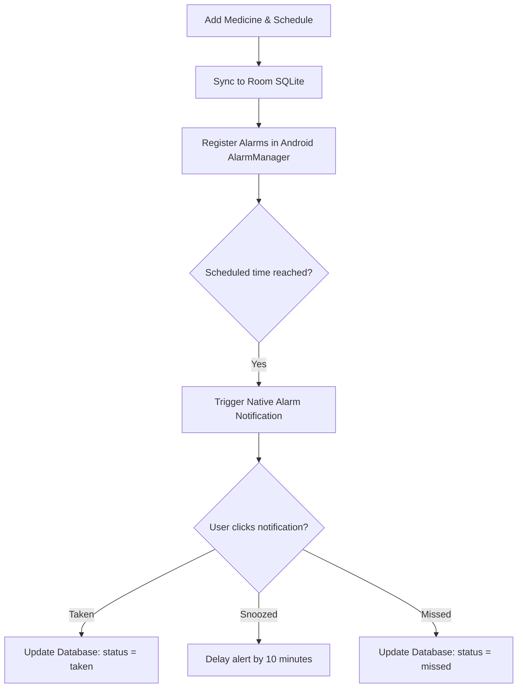

    
Chapter 21

    <h1>Medication Reminder Sequence</h1>
    
AlarmManager registrations, heads-up prompts, and adherence logging

    

        <strong>Summary:</strong> Details the scheduling engine and database logs used to manage medication compliance.
    

## 1. Medication Reminder Pipeline
Shows the native scheduling sequence and user compliance logging.

