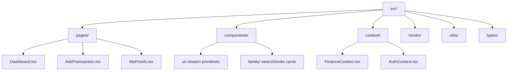

    
Chapter 24

    <h1>Frontend Core Architecture</h1>
    
Directory Structures, Component Model, Routing, and Lazy Chunks

    

        <strong>Summary:</strong> Details the react component design, state providers, and code directory structure.
    

## 1. Component Module Layout
The source directory structure decouples logic into contexts, custom hooks, and pages.

## 2. Core Frontend Patterns
* **Code Splitting:** Vite compiles views (such as `Analytics.tsx` and `Loans.tsx`) into separate chunks to optimize initial page loading.
* **Radix UI Primitives:** Dropdowns and modals are built on Radix primitives to support accessibility requirements.
