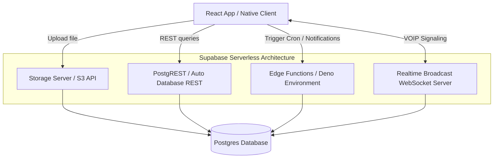

    
Chapter 25

    <h1>Backend Core Architecture</h1>
    
PostgREST gateways, S3 Storages, Realtime brokers, and Edge functions

    

        <strong>Summary:</strong> Details the backend components and serverless Edge Function architectures.
    

## 1. Serverless Execution Pipelines
Deno runtime components execute serverless tasks.

## 2. Edge Function Triggers
* **`send-notification`**: Fired by database webhooks on transaction updates, dispatching push messages via Firebase.
* **`daily-rates-push`**: PG_Cron executes this function daily to update current currency exchange and physical asset rates.
