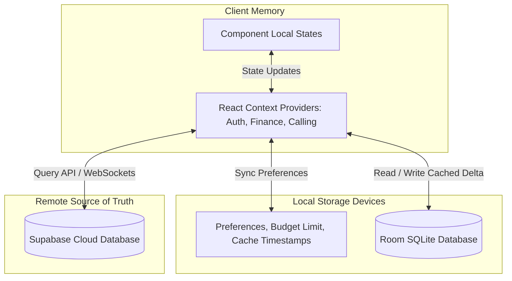

    
Chapter 26

    <h1>State Management &amp; Persistence</h1>
    
React Contexts, Local Storage, Room Cache, and Synchronization Queue

    

        <strong>Summary:</strong> Details the synchronization queue, offline storage logic, and local states.
    

## 1. Client-to-Cloud State Sync
Tracks data state sync between local storage and remote PostgreSQL.

## 2. SQLite Cache Deduplication
Incoming transaction records are assigned a unique SMS reference ID. A SQLite constraints checker drops duplicate entries if a collision occurs.
