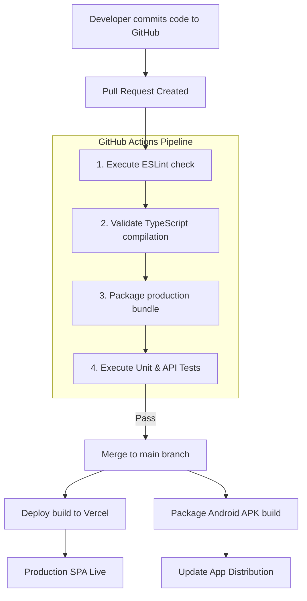

<div class="chapter-header">
    <div class="chapter-number-badge">Chapter 27</div>
    <h1>DevOps &amp; CI/CD Pipeline</h1>
    <div class="chapter-subtitle">Git workflows, Linting, Testing, and Production deployment</div>
    <div class="chapter-summary-box">
        <strong>Summary:</strong> Outlines the automated integration workflows and build checks used to deploy updates.
    </div>
</div>

## 1. Automated Integration Workflows
Details the actions triggered by code commits.



## 2. GitHub Actions Configuration
Validates code compiles successfully before merging:

<div class="code-container">
    <div class="code-header">
        <span>.github/workflows/validate.yml</span>
        <span class="code-lang-badge">yaml</span>
    </div>
```yaml
name: Build and Validate
on:
  push:
    branches: [main]
jobs:
  validate:
    runs-on: ubuntu-latest
    steps:
      - uses: actions/checkout@v4
      - name: Setup Node
        uses: actions/setup-node@v4
        with:
          node-version: 20
      - name: Run Build
        run: npm ci && npm run build
```
</div>
