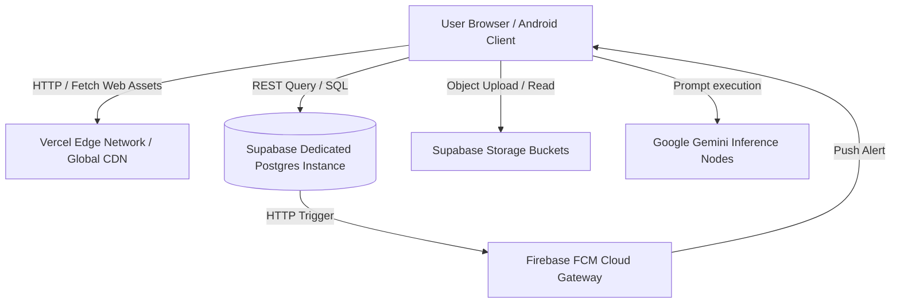

    
Chapter 28

    <h1>Deployment Architecture Blueprint</h1>
    
Edge Servers, Postgres Nodes, Object Storage, and FCM Gateways

    

        <strong>Summary:</strong> Architecture layout mapping production servers, static CDNs, and database nodes.
    

## 1. Production Infrastructure Deployment
Shows how client requests route to static and serverless nodes.

## 2. Operational Specifications
* **Vercel Global Edge CDN:** Serves static bundle assets, reducing latency.
* **Database Mirroring:** Database read replicas are configured to support heavy analytic aggregations.
