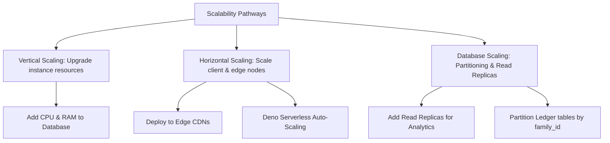

    
Chapter 29

    <h1>Horizontal &amp; Vertical Scalability</h1>
    
Scale-up, Scale-out, Replication, and Partitioning Strategy

    

        <strong>Summary:</strong> Outlines scaling strategies for the database, cache, and API gateways.
    

## 1. System Scaling Strategy
Outlines the vertical, horizontal, and database scaling strategies.

## 2. Scaling Implementation

### Horizontal API Scaling
Supabase Edge Functions execute in isolated Deno isolates, scaling horizontally to meet demand.

### Database Partitioning
Large tables like `transactions` can be partitioned logically by `family_id` to distribute the read/write load.
