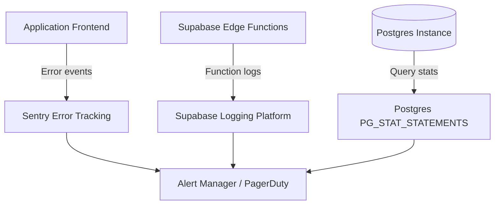

    
Chapter 31

    <h1>Observability &amp; Monitoring</h1>
    
Error tracking, Edge function logs, and Query performance metrics

    

        <strong>Summary:</strong> Details the logging and diagnostic systems used to monitor application health.
    

## 1. Monitoring Topology
Shows the flow of error logs from client to storage.

