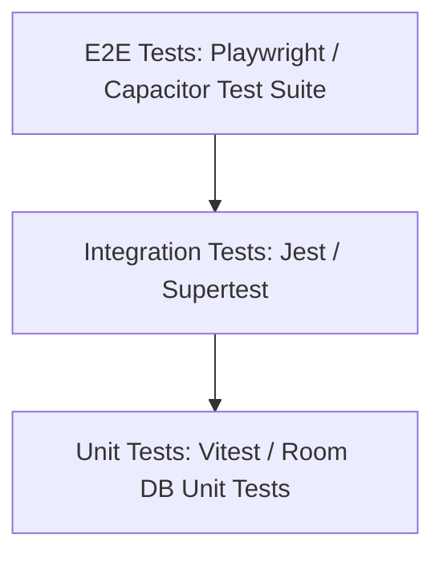

<div class="chapter-header">
    <div class="chapter-number-badge">Chapter 32</div>
    <h1>Verification &amp; Testing Strategy</h1>
    <div class="chapter-subtitle">Unit testing, Integration testing, and E2E browser flows</div>
    <div class="chapter-summary-box">
        <strong>Summary:</strong> Outlines the testing frameworks and test coverage targets.
    </div>
</div>

## 1. Testing Framework Structure
Shows the test types and associated frameworks.



## 2. Test Execution

### Running Frontend Tests
```bash
# Execute unit and component tests with Vitest
npm run test:unit
```

### Running Native Android Tests
```bash
# Execute unit tests in the Android project
./gradlew testDebugUnitTest
```
