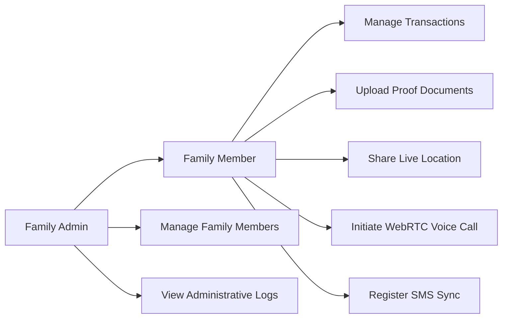
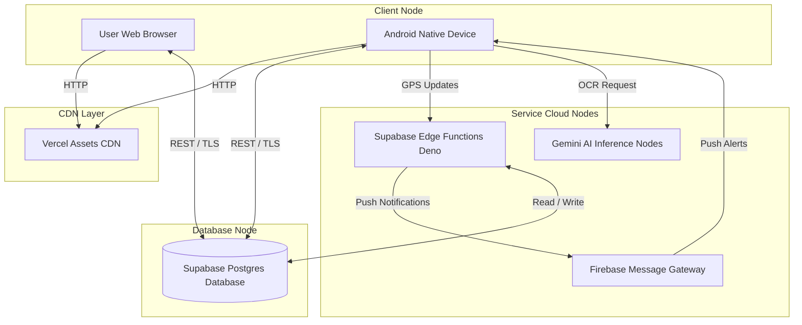

    
Chapter 36

    <h1>UML Core Blueprints</h1>
    
UML Use Case, Class, Sequence, and Deployment Diagrams

    

        <strong>Summary:</strong> System architecture blueprints illustrating user actions, component layouts, and deployment topologies.
    

## 1. Use Case Diagram
Outlines how users interact with various modules.

---

## 2. System Deployment Diagram
Shows the physical distribution of system components.

