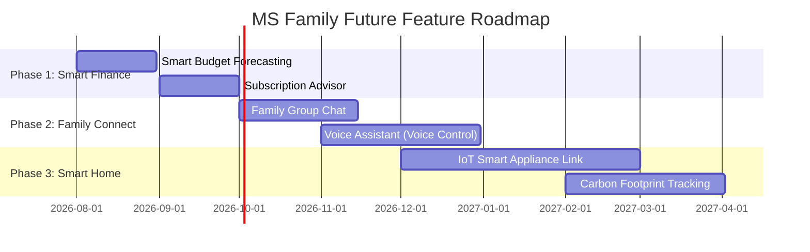

    
Chapter 39

    <h1>Product Evolution Roadmap</h1>
    
Phased development plans, forecasts, and integrations

    

        <strong>Summary:</strong> Future feature plans, forecasting integrations, and IoT linkages.
    

## 1. Roadmap Timeline
Shows the roadmap for future releases.

## 2. Future Module Definitions
* **Smart Budget Forecasting:** Uses historical transaction data to predict future household expenses.
* **IoT Smart Appliance Link:** Integrates with smart utility meters to track home energy usage on the dashboard.
